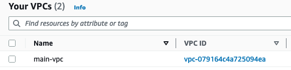

# Considerations
You need to provide my_ip var on CLI
You need to have AWS profile "generative-ai"

Example: `terraform apply -var-file=generative-ai.tfvars -var 'my_ip=188.193.217.191/32'`

# Timing

3 Aug
Start time - 10:30
End time - 11:00

5 Aug
12:30 - 14:00

# A/C

A modular approach is used. 

One cloud virtual network is provisioned. 

Two subnets (public and private) are provisioned using for_each meta-argument. 

Two identical virtual machines are provisioned using for_each meta-argument. 

The virtual machines are in the cloud virtual network, one in a private subnet and another in a public subnet. 

Terraform modules are published to GitHub. 

Terraform remote state is used with the selected Cloud applicable backend. 

Terraform and provider versions requirements and limits are properly incorporated. 

